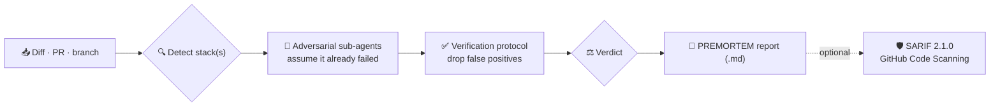

<div align="center">

# 🔮 premortem-code

### Assume the change **already failed in production** — then reason backward to find out why.

A [Claude Code](https://code.claude.com/docs/en/skills) skill that runs an **adversarial pre-mortem**
on a proposed code change, surfacing the fragilities that *pass tests but bite later* — and issuing a
`GO / REFINE / REWORK / ABANDON` verdict you can act on.

<br/>

[](SKILL.md)
[](https://github.com/fbmoulin/premortem-code/actions/workflows/ci.yml)
[](LICENSE)
[](#-requirements)
[](https://code.claude.com/docs/en/skills)
[](https://docs.github.com/en/code-security/code-scanning)
[](#-coverage)
[](tests/)

</div>

---

> [!NOTE]
> Reconstructed from verified public sources + a recovered output contract (see [`CREDITS.md`](CREDITS.md)).
> Behaviour-equivalent to the original (private) `premortem-code` — not a byte-for-byte copy.

## ✨ What it does

A pre-mortem flips code review on its head. Instead of asking *"is this correct?"*, it assumes the
change **has already broken in production** and reasons backward to the fragilities that let it
through — concurrency, data integrity, partial rollout, contract/type drift, agent/MCP edges,
migrations, and more.

It is **not a bug hunt** (current bugs) and **not a style review**. It targets the place where a
*plausible future edit* breaks something non-obviously.



## 🚀 Quick start

```bash
# 1. Install into your personal skills dir
cp -r premortem-code ~/.claude/skills/premortem-code

# 2. (optional) enable the SARIF exporter
python3 -c "import yaml" || pip install pyyaml

# 3. verify
ls ~/.claude/skills/premortem-code      # → SKILL.md  assets/  scripts/
```

> **Project scope** (commit it to a repo so the whole team gets it):
> `cp -r premortem-code <repo>/.claude/skills/`

Then, in **any** Claude Code session, just ask:

```text
Roda um premortem-code standard nas mudanças desta PR.
```

…or *"what could go wrong with this change?"*, *"is this safe for production?"*, *"premortem this diff"*.

## 🎚️ Modes

| Mode | Sub-agents | Reports | Best for | ⏱️ |
|------|:----------:|---------|----------|----|
| `quick` | 1 | `high` only | small PRs | ~5–10 min |
| **`standard`** _(default)_ | 1–3 | `high` + `medium` | day-to-day changes | ~10–20 min |
| `deep` | 3 (distinct lenses) | everything + cross-cutting contradictions | critical / infra changes | ~20–40 min |

## ⚖️ Verdicts

| | Verdict | Meaning |
|--|---------|---------|
| 🟢 | **GO** | No blocking finding — only `low` / tracked-for-followup. |
| 🟡 | **REFINE** | Findings exist, but every `high` is *local* — mergeable after pointwise fixes. |
| 🟠 | **REWORK** | ≥1 `high` *structural* finding — don't merge as-is. |
| 🔴 | **ABANDON** | A declared premise of the change is contradicted by a `confirmed` finding. |

The verdict is a **recommendation** — the human decides. The rubric is *operational* (mechanical
structural-vs-local + Confidence axes) so two runs converge.

## 📦 Output & SARIF export

Every run writes one report to `.premortems/PREMORTEM-<ISO8601>.md`. Export it for GitHub Code Scanning:

```bash
python ~/.claude/skills/premortem-code/scripts/sarif_export.py \
  --input .premortems/PREMORTEM-<ISO8601>.md
# → writes the sibling .sarif.json (SARIF 2.1.0)
```

<details>
<summary>Optional: upload to GitHub Code Scanning in CI</summary>

<br/>

Add a least-privilege job (only this job needs write scope). Pin the action by SHA and let
Dependabot keep it current:

```yaml
upload-sarif:
  runs-on: ubuntu-latest
  permissions:
    security-events: write   # required to upload to Code Scanning
    contents: read           # required for private repos
  steps:
    - uses: actions/checkout@<sha>            # v7.x
    - name: Generate PREMORTEM .sarif.json    # e.g. via your premortem step, then:
      run: python scripts/sarif_export.py --input .premortems/PREMORTEM-<ISO8601>.md
    - uses: github/codeql-action/upload-sarif@<sha>   # v4 (v3 deprecates Dec 2026)
      with:
        sarif_file: .premortems/PREMORTEM-<ISO8601>.sarif.json
```

This repo's own CI (`.github/workflows/ci.yml`) runs only `pytest` + `shellcheck` and grants
**no** write scopes; SARIF upload is opt-in for consumers who want findings in Code Scanning.

</details>

## 🧰 Coverage

The universal **10-category fragility catalogue** ([`assets/fragility-catalog-core.md`](assets/fragility-catalog-core.md))
is the baseline for every run. On top of it, **14 stack-specific addenda** sharpen the analysis:

<table>
<tr>
<td><b>Backend</b></td>
<td>Python/FastAPI · Postgres · Redis/ARQ · Qdrant · Supabase</td>
</tr>
<tr>
<td><b>Frontend</b></td>
<td>React/Next/Vue/Vite · Vercel · Playwright</td>
</tr>
<tr>
<td><b>Infra & AI</b></td>
<td>Docker/Kubernetes · AWS CDK · agents/MCP · fine-tuning · Anthropic skills · n8n</td>
</tr>
</table>

Stacks outside the table fall back to the core catalogue. A **verification protocol**
([`assets/verification-protocol.md`](assets/verification-protocol.md)) drops false positives before
anything reaches the report.

## 📁 Structure

```text
premortem-code/
├── SKILL.md                     # router: workflow · stack table · verdict rubric
├── assets/
│   ├── fragility-catalog-core.md      # the 10 universal categories
│   ├── verification-protocol.md       # anti-false-positive gates
│   ├── subagent-prompt.md             # adversarial sub-agent template
│   ├── premortem-md-template.md       # exact output contract
│   └── stack-*.md                     # 14 stack addenda
├── scripts/sarif_export.py      # PREMORTEM .md → SARIF 2.1.0
├── tests/test_sarif_export.py   # 8 passing tests
├── CREDITS.md · NOTICE · LICENSE
└── docs/superpowers/{specs,plans}/    # spec + plan + Plan Review Log (audit trail)
```

## 🔧 Requirements

- **Python ≥ 3.10** and **`pyyaml`** — only for the SARIF exporter; the skill itself needs neither.
- Ships **14 stacks / 18 assets** (4 base + 14 stack), matching the original deployment kit's coverage.

<details>
<summary>📐 How it was built</summary>

<br/>

Built and reviewed with the `dev-workflow` + `plan-review-cycle` skills. The full **Plan Review Log**
(2 rounds, 21 findings, all closed) lives in
[`docs/superpowers/specs/premortem-code-reconstruction.md`](docs/superpowers/specs/premortem-code-reconstruction.md).
See [`ANALYSIS.md`](ANALYSIS.md) for a later conformance audit against Anthropic's skill-authoring best practices.

</details>

## 📜 License

[MIT](LICENSE) © Felipe Moulin. Third-party attributions in [`NOTICE`](NOTICE) and [`CREDITS.md`](CREDITS.md).

<div align="center"><sub>Built for <a href="https://code.claude.com/docs/en/skills">Claude Code</a> · ship with confidence 🛡️</sub></div>
